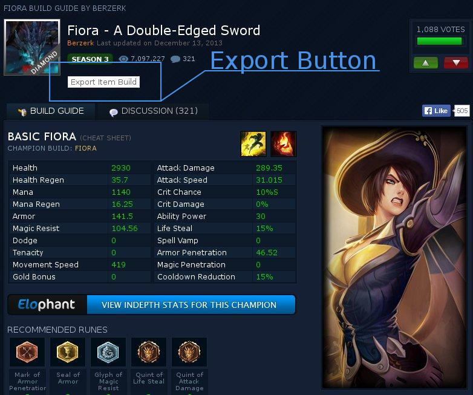

lol-Build-Exporter
==================

This Greasemonkey-Script lets you export a League of Legends build from [mobafire.com](http://www.mobafire.com/) and insert it right into the game. That way you can try new builds very fast, because you don't have to transfer the build *item by item* into the game.

How To Use
------------------

What you need to do:

* Get [Greasemonkey](https://addons.mozilla.org/de/firefox/addon/greasemonkey/) (or a similar extension for your browser).
* Then you have to add the `lolBuildExporter`-script to your Greasemonkey-extension.

Short example:

1. Activate the Greasemonkey-extension and go to your desired build. (i.e. http://www.mobafire.com/league-of-legends/build/fiora-a-double-edged-sword-198646)

2. After the website is loaded properly, you will find a new button called "Export Item Build" below the title of the specific build.
3. Click the button and download the build. It will be saved in a text/plain-json file.
4. Find your League of Legends-installation folder and go to `Config/Champions/<champion-name-of-build>/Recommended/` (i.e. `Config/Champions/Fiora/Recommended/`). If the folder does not exists, just create it.
5. Finally, place the downloaded json-file into that folder.

To use the new build, just select it in-game as you would normally do. **Have fun!**

Screenshots
-----------

##### Export Button added to [mobafire.com](http://www.mobafire.com/):

Further Information
-------------------

* Author: Dennis Leroy Wigand
* Version: 1.0.0

Licenses
--------

Didn't give a thought about that yet. So feel free to use it as you like.
